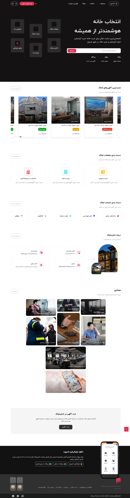
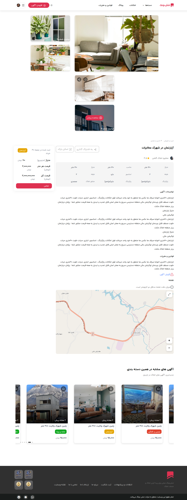
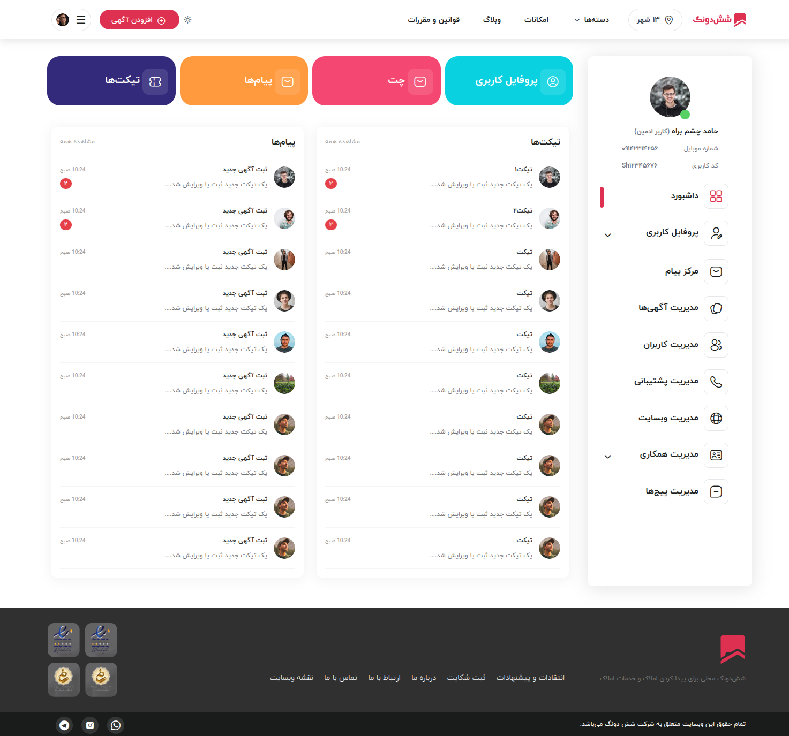

# 🏠 پروژه ۶ دونگ

## 📝 توضیحات پروژه
پروژه ۶ دونگ یک [مدیریت آگهی های املاک].  
این پروژه با هدف [تعامل خریداران و فروشندگان] طراحی و پیاده‌سازی شده است.

## 🛠️ تکنولوژی‌های استفاده شده
- **فرانت‌اند:** Plain Java Script, Bootstrap CSS
- **بک‌اند:** Go
- **ابزارها:** Docker, Git, GitHub

## 📸 تصاویر پروژه

### صفحه اصلی

### صفحه جزئیات محصول

### پنل مدیریت

### نمایش موبایل
.png)

## 👤 نقش من در پروژه
- توسعه دهنده قالب وبسایت  
